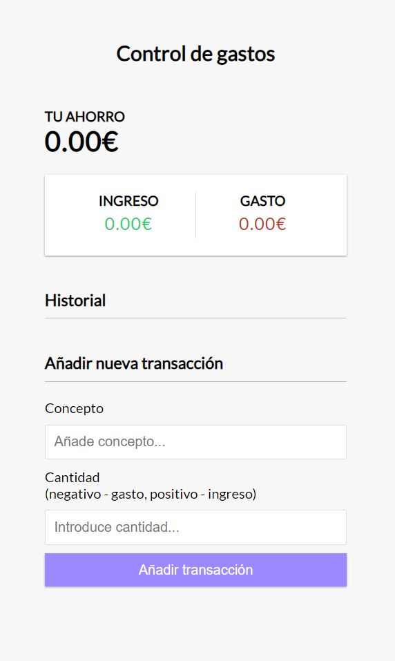
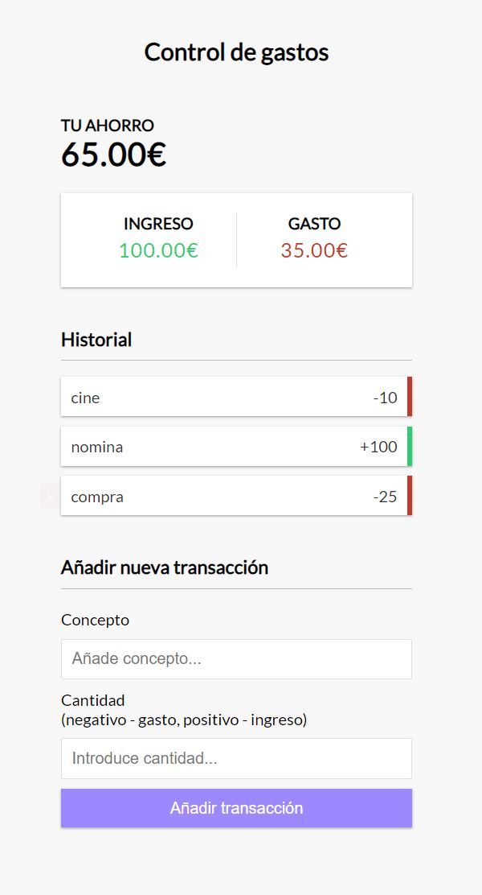

### Control de gastos

Necesitamos desarrollar una web que nos ayude a gestionar nuestros ingresos y gastos, con el objetivo de conocer el dinero que tenenos ahorrado.

## Requisitos indispensables
1. La aplicación deberá mostrar en todo momento el total de gastos, ingresos y el dinero total que tenemos ahorrado.
2. Podremos añadir un ingreso o un gasto incluyendo un concepto.
3. Podremos borrar cualquier gasto o ingreso que hayamos introducido.
4. Si se borra cualquier gasto/ingreso esto debe modificar tanto el total de gastos/ingresos, como el total de savings

## Requisitos opcionales
1. Si cerramos la web y volvemos a entrar, tenemos que recuperar todos los gastos e ingresos que habíamos introducido, así como el ahorro total.

## Ejemplo

